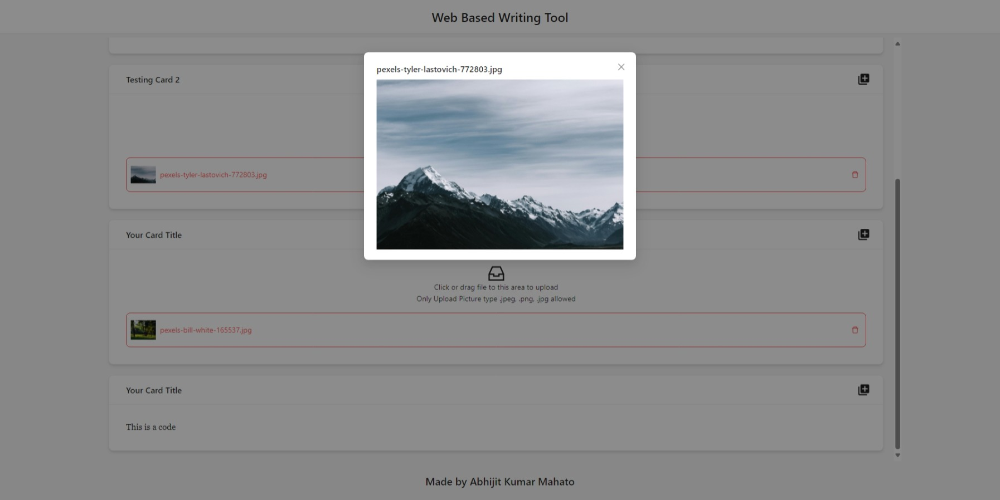

# Web-Based Writing Tool

This project is a web-based writing tool developed as part of the assessment given by [Applyin.co](https://applyin.co/) for an internship role. The tool allows users to create and edit documents using text blocks and picture blocks in a simple and intuitive interface.

## [**LIVE SITE**](https://webbasedwritingtool.netlify.app/) | [DEMO VIDEO]()

## Features

- **Interface Design:** Utilizes a black and white color scheme with Times Roman font (size 12) for text display. Implemented using Ant Design library, TailwindCSS and Framer Motion for frontend development which include draggable cards.
- **Block Functionality:** Users can add text blocks or picture blocks to the document, with a maximum of 250 words per text block. Blocks can be rearranged or inserted at specific positions.
- **Dynamic Block Management:** Users can add multiple blocks and create new blocks above or below existing ones.
- **Editing Tools:** Feature includes basic text editing tools such as bold, italic, underline and code block.
- **Responsive Design:** The tool is responsive and works well on different screen sizes.

## Screens

\
*Home Page*

\
*Create Block Modal*

\
*Default Blocks Page*

\
*Insert Block Modal*

\
*Updated Blocks Page*

\
*View Picture Modal*

## Technical Details

- **Frontend Framework:** Developed using React framework, utilizing React hooks, state management, and component lifecycle.
- **Code Quality:** Clean and well-documented code adhering to best coding practices and design patterns relevant to React.

## Technologies Used

- Vite
- React.ts
- Tailwind CSS
- Ant Design
- Framer Motion
- React Icons

## Installation

To run the project locally, follow these steps:

1. Clone the repository:

   ```bash
   git clone https://github.com/Abhijitkr/Web-Based-Writing-Tool.git
   ```

2. Navigate to web-based-writing-tool

   ```bash
   cd web-based-writing-tool
   ```

3. Install Dependencies

   ```bash
   npm install
   ```

4. Run the application

   ```bash
   npm run dev
   ```

The development server will start, and you can access the application by visiting `http://localhost:5173` in your web browser.

## Usage

1. Navigate to the application URL in your web browser **or** setup locally using the above process.
2. Click on the "Add Block" button to start adding content blocks to the document.
3. Choose between text blocks or picture blocks also choose if you want to create single or multiple blocks at the same time and enter content accordingly.
4. Rearrange or insert blocks as needed using the provided functionality.
5. Also can add content blocks above of below the current content block.
6. Utilize optional editing tools if enabled.
7. Ensure responsive design by testing the tool on different screen sizes.

## Contact

If you have any questions or just want to connect below are my contacts [Twitter(X)](https://twitter.com/AbhijitKrM), [LinkedIn](https://www.linkedin.com/in/abhijitkrma/).

### Happy Coding
